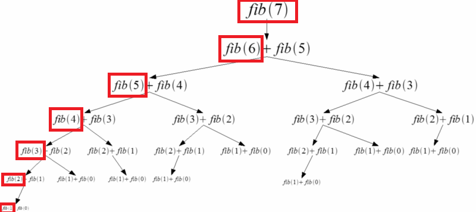

# Memoization
- DP의 구현 방법 중 하나
- 한번 계산한 결과를 메모리 공간에 메모하는 기법
- 이 기법을 사용하면 모든 부분 문제가 한번씩 계산된다고 보장할 수 있기
때문에 함수 호출 횟수가 엄청나게 감소함을 예상할 수 있다.
```
// 일반 재귀 함수
// 중복된 계산을 반복해서 하게 된다. 시간복잡도 O(2^n)으로 x의 수가 커질수록 복잡도가 엄청나게 커짐
static int fibo(int x) {
   if( x ==1 || x==2) return 1;
   return fibo(x-1) + fibo(x-2);
}


// Memoization 
// 하위 문제의 결과 값을 dp[]배열에 저장해놓고 필요할 때마다 계산된 값을 호출
static int fibo(int x) {
   if( x ==1 || x==2) return 1;
   if(dp[x] != 0) return dp[x];
   dp[x] = fibo(x-1) + fibo(x-2);
   return dp[x];
}
```
## 메모제이션 특징
- 같은 문제를 다시 호출하면 메모했던 결과를 그대로 가져온다.
- 값을 기록해 놓는다는 점에서 캐싱(Cashig)이라고 한다.
- DP에만 국한된 개념이 아니다. 결과를 담아 놓기만 하고 DP가 아닌 다른 방식으로도 활용될 수 있다.
